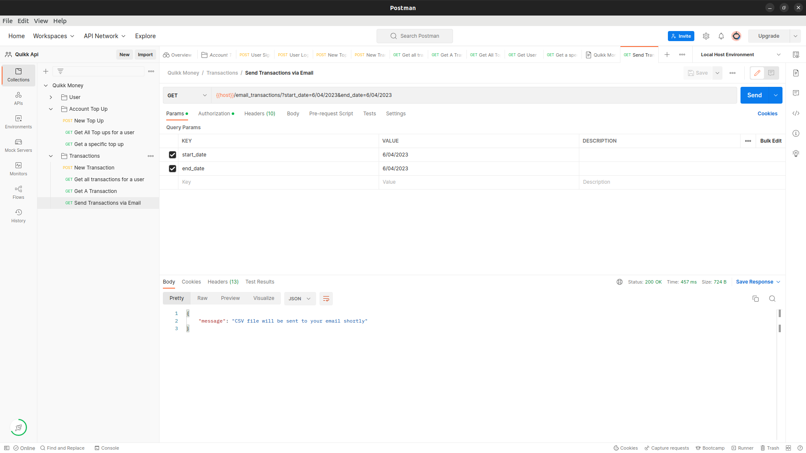

#QUIKK MONEY
> A client wants to build a web platform that can enable users to register and send money to each other within the system. They top up their accounts through MPESA* and can now transfer amongst themselves. They use the registered number or email address to transfer.  Once a transfer is done, the recipient receives a notification in the system as well as a confirmation through email. A user should be able to trigger an email report summarising all the transactions they have done for a selected number of days. The users will use the application mostly on their phones so it should work well on a mobile browser.

## Languages, tools and topics covered
 - Ruby 3.1.2
 - Ruby On Rails 7
 - sidekiq
 - rspec
 - postman for api documentation
 - Postgress
## Getting Started
To get a local copy up and running follow these simple example steps.
- Clone all the files and branches into your local machine
- Run bin/setup to set up the application i.e: Install the gems, create, migrate and seed the database.
- Run bin/rails db:migrate to run the migrations

### Prerequisites

- Ruby should be well installed and configured
- Ruby on Rails 7 should be installed

### How to Run

Once Configured, run rails server. This runs rails server to start up the rails server
You can now you use the api however you want

## Authors

👤 **Nick**

- GitHub: [@Nkuria](https://github.com/Nkuria)
- LinkedIn: [Nick Kuria](https://www.linkedin.com/in/nkuria/)
